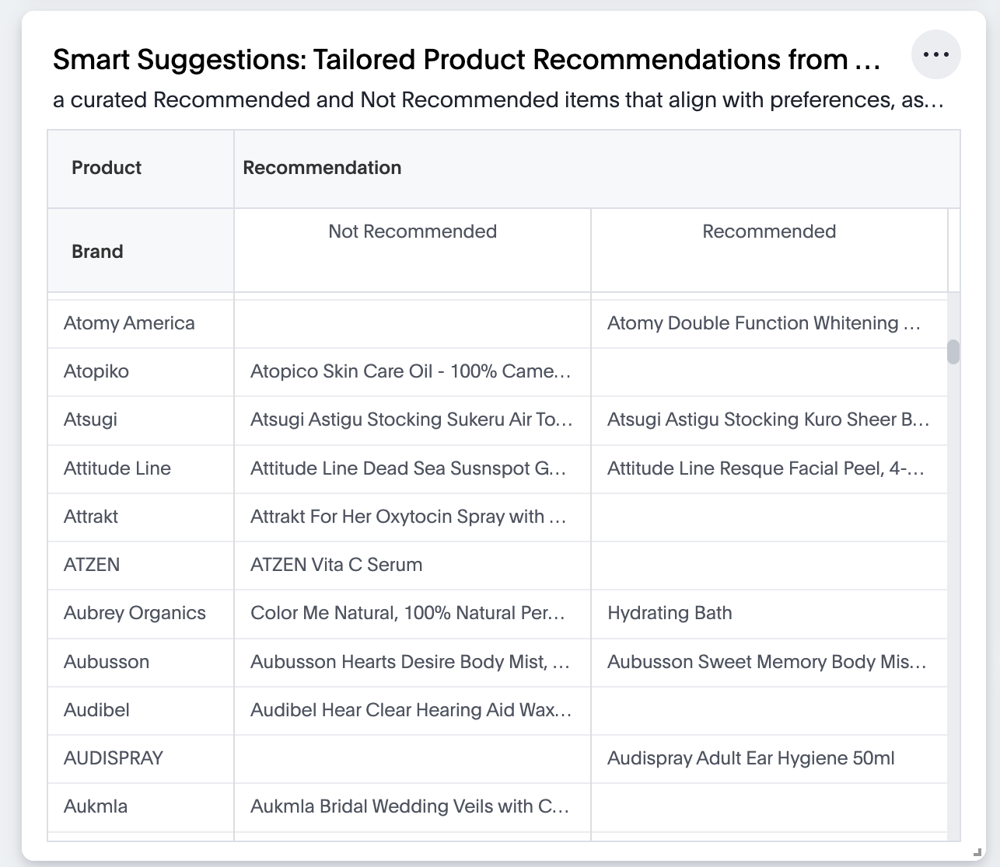

# Python-sentiment-analysis
Sentiment Analysis using Python

  Sentiment analysis, a part of natural language processing (NLP), digs into feelings and thoughts expressed in text. It helps figure out if the text is positive, negative, or somewhere in between. With so much text online—like reviews and social media—sentiment analysis is like a detective tool for understanding what people really feel. It's not just about reading words; it's about using computers to understand tons of text all at once.

  Sentiment analysis is useful for businesses. It helps them learn what customers like or don't like. For example, it can tell if people are excited about a new product or if they're not happy with a service. This helps companies make smart choices. But figuring out feelings in text isn't easy. Sometimes, people write in funny ways or use words that mean something else. Sentiment analysis is like a puzzle where computers try to fit together the pieces of what people say to understand how they really feel.

  Unlock the potential of sentiment analysis using Snowflake-Snowpark-Python and Amazon Beauty product reviews. By combining Snowpark's processing capabilities and ThoughtSpot’s AI-powered analytics, organizations can now make complex data science insights readily available to their business users.

In this demo, we are exploring a dataset of Amazon reviews for beauty products. 


## Overview
Apply Amazon Beauty product review data to perform sentiment analysis, process data with Snowpark Python, and visualize results via ThoughtSpot.

## Prerequisites
- VSCode
- Python 3.8+
- pip 
- Snowflake account with read,write access to database
- AWS S3 bucket read access along with access key and secret key 


## Setup

### 1. VSCode Installation
Download and install [VSCode](https://code.visualstudio.com/download), then follow the installation guides for [Mac](https://code.visualstudio.com/docs/setup/mac), [Linux](https://code.visualstudio.com/docs/setup/linux), or [Windows](https://code.visualstudio.com/docs/setup/windows).

### 2. Extensions Installation
Open VSCode, click on the Extensions icon, search, and install ‘Jupyter’ and ‘Python’.

### 3. Python Libraries Installation
To perform sentiment analysis, ensure you install the following libraries via the terminal using the 'pip install <library_name>' or 'python -m pip install <library_name>'
- Snowflake-snowpark-python
- Snowflake-connector-python[pandas]
- Pandas
- Numpy
- Matplotlib
- Wordcloud
- Nltk
- Boto3
- Text2emotion

### 4. Connecting to Snowflake
Create a new .json file with your Snowflake account details for connection.

```
{
    "account"   : "ADD YOUR SNOWFLAKE ACCOUNT NAME ",
    "user"      : "***********",
    "password"  : "***********",
    "role"      : "USER_ROLE",
    "warehouse" : "WAREHOUSE_NAME",
    "database"  : "DBNAME",
    "schema"    : "PUBLIC"
  }
```

### 5. Connecting to AWS S3 Bucket
Replace the placeholder AWS keys with actual keys in the script to read the S3 bucket JSON data.
```

def read_json(bucket:str,filename:str)-> T.Variant:
    import boto3
    import json
    import pandas as pd
```

### 6. Reading the Data
The Amazon review dataset consists of two files: All_Beauty.json, meta_All_Beauty.json. Scripts are provided to read and process the AWS data.

### 7. Data Clearning and Merging
Employ the scripts for data cleaning and merging, creating a dataset ready for analysis.

### 8. Calculating Vader Sentiment Score and Sentiment
Using helper functions, calculate Vader sentiment scores. The cleaned data, with sentiment scores included, is then added to a Snowflake table named ‘BEAUTY_PRODUCT_REVIEWS’ for further analysis.


### 9. Emotion Detection Using Review Data
Apply the text2emotion library to determine the emotions expressed in each review. The results are stored in a Snowflake table named ‘EMOTIONS_OVERALL’.


### 10. Category-based Analysis
Categorize products and perform an analysis based on these categories. Results can be stored and analyzed in another Snowflake table ‘Category Analysis’
In the provided code, we extract only the necessary columns from the refined dataset. Notably, we apply a filter to obtain data from the top 10 product categories, focusing on those with substantial review counts. 

### 11. Product Recommendations
Leverage sentiment scores to classify products as recommended or not based on sentiment expressed in reviews.We establish a classification threshold of 0.75 to determine whether a product should be categorized as recommended or not. Store the recommendations in a Snowflake table named ‘RECOMMENDATIONS’ for easy retrieval and analysis.



### 12. Examining Sentiment Trends Over Time
Examining sentiment trends over time involves tracking how sentiments expressed in reviews change across different periods. This analysis helps uncover patterns and fluctuations in sentiments, offering valuable insights into customer opinions and reactions. Store this data in the ‘SENTIMENT_TRENDS’ Snowflake table.


## Guide to use .tml files
For step-by-step instructions on how to import .tml files into your ThoughtSpot cluster please refer [How to use TML files](https://docs.thoughtspot.com/cloud/latest/scriptability#_how_to_use_tml_files)

## Conclusion 
After connecting to Snowflake, ThoughtSpot’s AI-powered Analytics allow anyone to ask and answer questions from our Snowpark’s machine-learning results. 

That’s Snowpark for ThoughtSpot, bridging the gap between data science and business outcomes.


